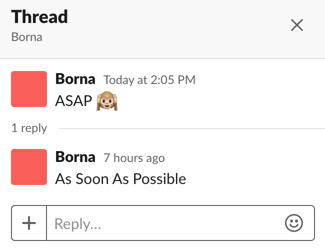

# SlackDB

A key/value database courtesy of Slack 🙃. This is not a joke.

SlackDB is a middleperson between Slack and your Slack app that facilitates the orchestration of Slack channels across multiple workspaces as a k/v database. SlackDB is highly interactive and it natively supports array storage, rollbacks, and democracy. All powered by the 😈 cloud 😈.

The benefits of using slack as a database are:
* Slack covers the compute
* Slack covers the persistent storage
* You can allow users to vote on values using reactions
* Native support for arrays through Slack's reply threads
* Roll back changes by deleting messages 
* Absolutely free 

SlackDB is be extremely useful for Slack apps that need persistant storage but can't justify spinning up an entire database. Obviously, it isn't as performant as a dedicated database but it's easy to use, free (in just about every sense), and has a few unique interactability features.

## How?

Messages are keys and replies are values. Emojis represent metadata. 



#### Key Types and Metadata

Built into SlackDB are 4 basic key types:
* 👍 votable -- treat the replies to a key as a ballot where reactions represent support for that particular value. winner takes all.
* 👪 multiple -- treat the entire reply thread as an array
* 🙉 single value push front -- treat the very first reply in the thread as the value
* 🐒 single value push back -- treat the most recent reply in the thread as the value

#### More Metadata

SlackDB also offers the following additional metadata options that can simply be appended to the key message:
* 🚯 constant -- don't allow the key to be edited via update/append commands
* ⚓ undeletable -- don't allow the key to be deleted

## Installation
<!-- 
If [available in Hex](https://hex.pm/docs/publish), the package can be installed
by adding `slackdb` to your list of dependencies in `mix.exs`: -->

Add the `:slackdb` dependency to your `mix.exs` file:

```elixir
def deps do
  [
    {:slackdb, "~> 0.1.1"}
  ]
end
```

Then, run mix deps.get in your shell to fetch the new dependency.

<!-- 
Documentation can be generated with [ExDoc](https://github.com/elixir-lang/ex_doc)
and published on [HexDocs](https://hexdocs.pm). Once published, the docs can
be found at [https://hexdocs.pm/slackdb](https://hexdocs.pm/slackdb). -->

## Configuration

Before startup, you'll need to:
* Create a (private) supervisor channel on each server on which you want to use SlackDB
* Add your app's bot user to that channel
* Record the channel's name and ID

This channel is responsible for storing the current state (meaning a map of channel names->ids that are currently 'registered') of the database on that particular server. On startup, SlackDB will look in this channel and load the current state. If it can't find the current state, it will start from scratch assuming no channels have yet to be registered with the DB

Your app needs to have the following scopes to get full SlackDB functionality:
`search:read`, `chat:write`, `chat:write:bot`, `chat:write:user`,`channels:write`, `groups:write`, `channels:read`, `groups:read`, `	reactions:read`, `channels:history`, `groups:history`, 

Once you have your supervisor channels, fill out the config like so:

```elixir
config :slackdb,
  servers: %{
    "server_name" => %{
      bot_token: "xoxb-shhh...",
      user_token: "xoxp-shhh...",
      bot_name: "Jeanie",
      supervisor_channel_name: "slacckdb-admin",
      supervisor_channel_id: "CFC6MRQ06"
    }
    # "server2" => %{...}
  }
```

## Usage

It's pretty simple. Here is an example from the command line:
```elixir 
iex> {:ok, pid} =  SlackDB.Server.start_link()
iex> SlackDB.dump() 
%{
"server_name" => %{
  bot_token: "xoxb-shhh...",
  user_token: "xoxp-shhh...",
  bot_name: "Jeanie",
  supervisor_channel_name: "slackdb-admin",
  supervisor_channel_id: "CFC6MRQ06",
  channels: %{"loaded_from" => "supervisor_channel"}
}
```
You'll notice how the server config has an additional key, `:channels`, which was loaded from the supervisor channel on startup. If this is your first time starting up SlackDB and nothing is in the supervisor channel, it'll be an empty map.

At this point you can use the CRUDA (CRUD + Append) interface for interacting with the database.

You can create new channels or include existing channels through the API and their respective supervisor channels will automatically be updated with the new state. Note that SlackDB can read from any channel that the user token has access to but it can only write to channels that the bot user is in.


## Notes on Limitations
### Rate limiting
The update and delete commands require deleting an entire thread of messages. They do it by calling Slack's `chat.delete` endpoint on each message in the thread (concurrently). This [endpoint](https://api.slack.com/methods/chat.delete) has Tier 3 rate limiting which means it can only handle ~50 calls per minute. Threads with over 50 replies may be at risk of not being fully deleted. 

### Search delay
Recently posted messages won’t be available to search for a few seconds. Creating a key and then reading it won’t work until ~5 seconds after the key was posted.

### Vulnerability to nasty users
Users are able to interact with SlackDB channels by reacting, adding keys, and adding values.
Nasty Users could try to fuck with you by:
* Posting duplicate keys
* Posting values that fit the key schema

which would increase the search/processing time and, in some cases, cause SlackDB to hurt itself in confusion 🐤🐤🐤.

SlackDB attempts to mitigate these issues by giving you the option to only recognise keys posted by the bot user. Replies from real users that match the key schema will no longer be an issue. Additionally, you can always use private channels to control which users have access to the DB.

In the future, this could be handled using a dedicated HTTP server and the Events API which could screen incoming posts from real users and filter out the sketchy ones.

### Bot user limitations
Bots can't invite themselves to channels 😞. Whenever you add a new channel or include an existing one to the database, you're going to need to invite the bot user so it can post messages 

This is actually a fairly simple problem to solve since we can use the user token to invite the bot. Unfortunately, Slack's Web API doesn't make it easy to retrieve bot IDs. You'll need to paginate through `users.list` and look for the bot. (In fact, this process could happen on startup and then be loaded into the GenServer state). peep the Issues on this repo
