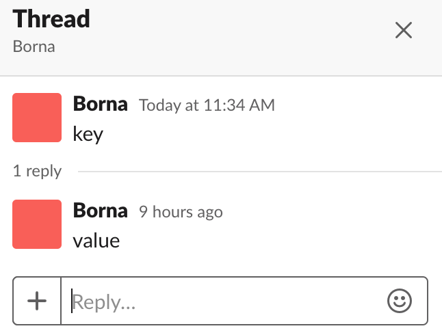
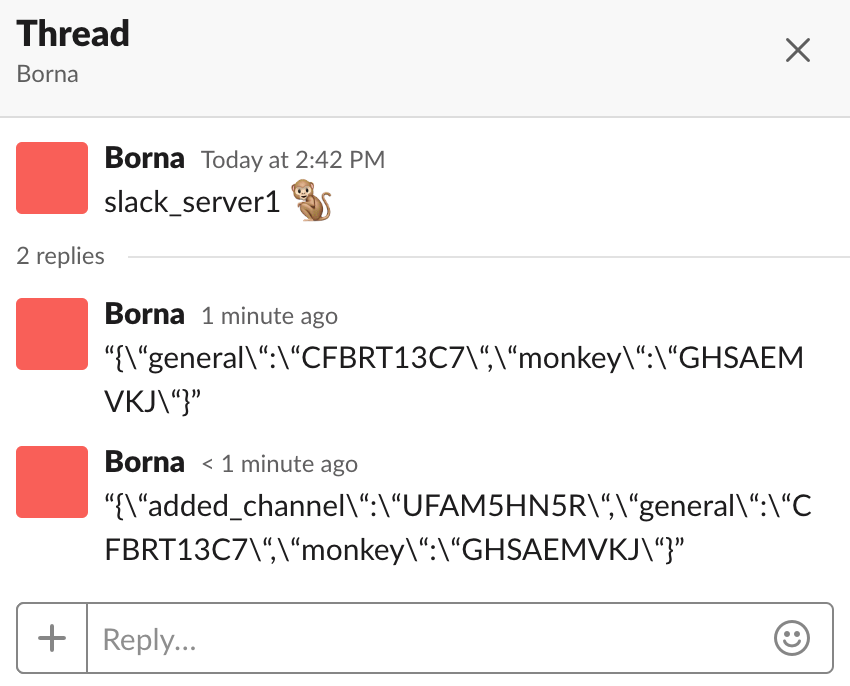

# SlackDB Design Proposal

> THIS DESIGN PROPOSAL IS NO LONGER FULLY REPRESENTATIVE OF THE ACTUAL DOCUMENTATION FOR THIS LIBRARY. FOR REAL DOCUMENTATION, USE HEX.PM AND THE READ ME.

Let's build a key/value database which takes advantage of Slack’s infrastructure.

The benefits of using slack as a database are:
* Slack covers the compute
* Slack covers the persistent storage
* We can allow users to vote on values using reactions
* Native support for arrays through Slack's reply threads
* Roll back changes by deleting messages
* Slack covers the costs too lmao

SlackDB would be extremely useful for Slack apps that need persistant storage but can't justify spinning up an entire database. It definitely won't be as performant as a dedicated database but it's easy to use, free (in just about every sense), and has a few unique features.

### Messages as Keys, Replies as Values

This is pretty simple



### Key Types and Metadata

If we put on our thinking caps, we can identify 4 basic types of keys that Slack could support:
* 👍 votable -- we could treat the replies to a key as a ballot where reactions represent support for that particular value. winner takes all.
* 👪 multiple -- we could treat the entire reply thread as an array
* 🙉 single value push front -- we could treat only the very first reply in the thread as the value
* 🐒 single value push back -- we could treat only the most recent reply in the thread as the value

Those emojis aren't just for fun. We'll also need a way to store metadata with the keys to identify how we want to grab the coresponding values. For that, we can simply place the emojis after the key. When we search for the key, the response will bring back the emoji metatada with it for no extra cost. Emoji's aren't even searchable in Slack (unless wrapped with `:`s) so they're a safe choice to go with. We can treat a response with no emoji as either *a) not a key* or *b) make the key-type default to 👪*.

So, after adding the metadata we have: 


### More Metadata

We could add as much metadata as we want by simply appending more emojis. Proposed here are some quality of life features and their associated emojis:
* 🚯 constant key -- raise an error if the user tries to modify the value of a key with this identifier
* 🛑 locked key -- a temporary lock on a key while major modifications are happening. any requests to modify/read a key while this emoji is up should be blocked/raised. this is a suggestion for the future and doesn't need to be implemented in v0.1.0

## Configuration

SlackDB would be able to span multiple servers and multiple channels using a configuration like the following:
```elixir
config :slackdb, servers: %{
	"slack_server1" => %{
		token: "shhh…",
		supervisor_channel: "CHANNEL_ID"
	}
	# "server2" => %{...}
}
```
On startup, a SlackDB GenServer would be created to hold and maintain the state of the database. It would pull the state as a stringified json using a `single value push back` key in the `supervisor_channel`. Check it out:


A copy of the map would be stored in memory for quick reading. Any changes (e.g., adding a channel, archiving a channel) would trigger an update to the map in memory as well as the key in Slack.

> Notice that it's entirely possible to have 2 supervisor_channels in the same server. You can have multiple, entirely disjoint instances of SlackDB on the same workspace.

## User Interaction and Validation

Users should be able to manually add values through Slack's UI as well as through this library. This opens us up to issues from Nasty Users. 

Nasty Users could try to fuck with us by:
1. Posting duplicate keys
2. Posting values using the key schema

which would increase the search/processing time and, in some cases, cause SlackDB to hurt itself in confusion 🐤🐤🐤. 

There are a couple ways we could address this:
* Only trust *keys* posted by a slackbot specified in the config (or master channel). Then, all replies from users, regardless of the schema, can be accepted. This solves only problem 2, limits user interaction such that only the bot can post keys, and is trivial to implement.
* Subscribe to users posting to DB channels through the Events API and filter their messages. When a user posts, ensure that it follows the correct schemas and isn't a duplicate. If the post is not valid, remove it. This solves both problems 1 & 2 and doesn't limit user interaction.

## SlackDB's APIs

some typespecs to keep in mind:
```elixir
@type key_type :: :voting | :multiple | :single_front | :single_back 

@type key :: %{
        required(:server_name) => String.t(),
        required(:channel_id) => String.t(),
        required(:ts) => number,
        required(:key_type) => key_type,
        required(:key_phrase) => String.t(),
        optional(:channel_name) => String.t()
      }

@type value :: String.t | list(String.t)
```

#### Public API
* Dealing with Channels -- each channel is it's own partitioned key/value map
  * ```elixir
    # required scopes: channels:write, groups:write
    # uses: conversations.create
    # create a public or private channel, return channel_id, add new channel name and id to map in SlackDB genserver
    @spec create_channel(String.t, String.t, boolean) :: {:ok, channel_id} | {:error, String.t}
    def create_channel(server_name, channel_name, private? \\ false)

    # required scopes: channels:write, groups:write
    # uses: conversations.archive
    @spec archive_channel(String.t, String.t) :: {:ok | :error, String.t} 
    def archive_channel(server_name, channel_id)

    # required scopes: groups:write
    # uses: groups.invite 
    # invite a user to the supervisor channel
    @spec invite_supervisor(String.t, String.t) :: {:ok | :error, String.t} 
    def invite_supervisor(server, user_id)
    ```
* Writing to a Channel
  * ```elixir
    # requires scopes: search.messages, chat:write, channels:history, groups:history
    # uses: search.messages |> conversations.replies |> chat.delete
    # deletes key message and entire thread
    @spec drop_key(String.t, String.t, String.t) :: {:ok | :error, String.t}
    def drop_key(server_name, channel_name, key_phrase)

    # requires scopes: search.messages, chat:write, channels:history, groups:history
    # uses: search.messages |> conversations.replies |> chat.delete
    # finds value among thread and deletes that message. this may complicate things with keys having 0 values
    @spec drop_value(String.t, String.t, String.t) :: {:ok | :error, String.t}
    def drop_value(server_name, channel_name, key_phrase, value)

    @spec put_kv(String.t, String.t, String.t, key_type, value, const?) :: {:ok | :error, String.t}
    # requires scopes: search.messages, chat:write, channels:history, groups:history
    # uses: search.messages |> conversations.replies |> chat.delete |> chat.postMessage
    # deletes all replies and adds updated value (sacrifices rollback-ability, but secure)
    def put_kv(server_name, channel_name, key_phrase, :single_front, value, const? \\ false)

    # requires scopes: search.messages, chat:write
    # uses: search.messages |> chat.postMessage
    # adds updated value to end of thread (can be tampered with by users)
    def put_kv(server_name, channel_name, key, :single_back, value, const? \\ false)
    def put_kv(server_name, channel_name, key, :voting, value, const? \\ false)
    # given an array, posts each message to the end of thread
    def put_kv(server_name, channel_name, key, :multiple, value, const? \\ false)
    ```
* Reading Keys 
  * ```elixir 
    # required scopes: search:read, channels:history, groups:history, reactions:read
    # uses: search.messages |> conversations.replies |> action based on metadata
    # when you specify a channel name it’ll look in the GenServer state and if it’s not there it’ll use the name as the ID
    @spec read(String.t, String.t, String.t, key_type) :: {:ok, value} | {:error, String.t}
    def read(server_name, channel_name, key_phrase, key_type \\ :multiple) 
    ```

#### Major Behind the Scene Helpers...
```elixir
# required scopes: search:read 
# uses: search.messages
@spec search(String.t, String.t, String.t) :: {:ok, key} | {:error, String.t}
defp search(server_name, channel_name, key_phrase)

# required scopes: channels:history, groups:history 
# uses: conversations.replies
@spec get_thread(key) :: {:ok, list(map())} | {:error, String.t}
defp get_thread(key)

# required scopes reactions:read
# uses: reactions.get (if type :voting, otherwise uses no web endpoint)
@spec parse_thread(list(map()), key_type) :: value
defp parse_thread(replies, key_type)
```
